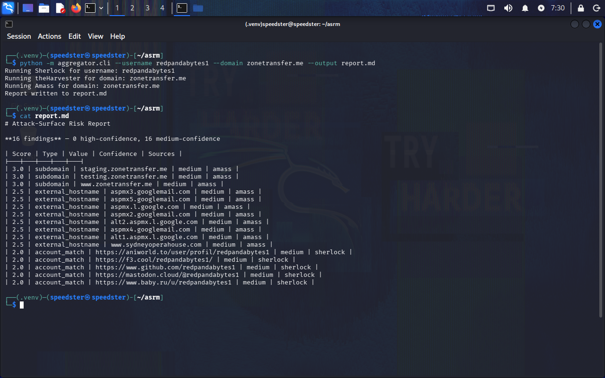

# Attack-Surface Risk Mapper

## Overview

Attack-Surface Risk Mapper is a passive OSINT aggregation pipeline that combines Sherlock, theHarvester, and Amass into a single workflow. Instead of treating each tool's output as an isolated dataset, the project normalizes findings into a common schema, correlates results across tools, assigns corroboration-based confidence, applies heuristic priority scoring, and produces a readable Markdown report.

I built this because I got tired of running Sherlock, theHarvester, and Amass separately and manually cross-checking what each one found, especially because they expose completely different kinds of data. I wanted to automate that correlation instead of treating each tool's output as an isolated list.

## Features

- Run Sherlock, theHarvester, and Amass against a target in a single command
- Normalize each tool's output into a common schema — eight finding types (`account_match`, `subdomain`, `email`, `ip_address`, `netblock`, `asn`, `organization`, `external_hostname`)
- Deduplicate overlapping findings across tools, with corroboration-based confidence scoring (a finding seen by 2+ tools is scored `high`)
- Heuristic risk-scoring with per-type weights, reflecting how directly actionable each finding category is
- Generate a unified, sorted Markdown report
- CLI flags for target selection (`--username` / `--domain`), tool selection (`--tools`), and output location (`--output`)

## Architecture

```
                      User input
                          |
          +---------------+---------------+
          |                               |
      --username                       --domain
          |                               |
          v                               v
     Sherlock                    theHarvester / Amass
          |                               |
          +---------------+---------------+
                          |
                          v
                 Raw tool results
                          |
                          v
                  report/builder.py
                          |
          +---------------+---------------+
          |               |               |
          v               v               v
     Normalization    Deduplication   Correlation
          |               |               |
          +---------------+---------------+
                          |
                          v
                    Confidence
                          |
                          v
                  Heuristic Scoring
                          |
                          v
                  Sorted Findings
                          |
                          v
                  Markdown Report
```

## Project Structure
```
asrm/
├── aggregator/
│   ├── __init__.py
│   ├── cli.py
│   ├── utils.py
│   ├── runners/
│   │   ├── __init__.py
│   │   ├── sherlock_runner.py
│   │   ├── theharvester_runner.py
│   │   └── amass_runner.py
│   └── report/
│       ├── __init__.py
│       └── builder.py
├── tests/
│   └── asrm_test.py
├── docs/
│   ├── screenshots/
│   ├── reports/
│   ├── schema_notes.md
│   └── writeup.md
├── requirements.txt
├── .gitignore
├── LICENSE
└── README.md
```

## Installation

Clone the repository:
```bash
git clone https://github.com/redpandabytes1/attack-surface-risk-mapper.git
cd attack-surface-risk-mapper
```

Create and activate the Python virtual environment:
```bash
python3 -m venv .venv
source .venv/bin/activate
```

Install the Python dependencies:
```bash
pip install -r requirements.txt
```

This project relies on `sherlock`, `theHarvester`, and `amass` being installed and available on your system `PATH` - see each tool's own documentation for installation (all three are available via `pipx` or your distribution's package manager; Amass specifically requires v4, as v5's new engine architecture has an unresolved connectivity bug at the time of writing).

## Usage

```bash
python -m aggregator.cli --username <username> --domain <domain> --output report.md
```

Example:
```bash
python -m aggregator.cli --username redpandabytes1 --domain zonetransfer.me --output report.md
```



## Legal & Ethical Use

This tool is intended for authorized OSINT research only - against your own accounts/infrastructure, or targets you have explicit permission to investigate (e.g. a CTF, a bug bounty program's defined scope, or an engagement you're contracted for). Do not use it against third parties without consent.

## Design Decisions & Lessons Learned

**Data richness varies enormously by target, and that's not a bug.**
One of the biggest surprises was how different the amount and structure of OSINT data could be between targets. A sparse test domain produced almost nothing, while a richer real-world domain produced dozens of theHarvester hosts and hundreds of Amass graph relationships - one run returned 6 Sherlock matches with zero domain findings, while another returned 50 theHarvester hosts and 631 Amass graph records for the same pipeline. That forced me to design the normalization layer around the assumption that "no
results" and "tool failure" are different things, not the same failure mode wearing different clothes.

**Amass's output is a relationship graph, not a flat list.**
Amass exposed relationships between FQDNs, IP addresses, netblocks, ASNs, organizations, and external hostnames rather than a simple subdomain list, so the parser had to model distinct entity types instead of copying raw tool output directly into a single field.

**Silent data loss is worse than a crash, and easy to introduce accidentally.**
A single-character typo in matching Amass's `RIROrganization` entity type caused every organization finding to be dropped entirely with no error raised, and a separate bug briefly caused the target's own root domain to be misclassified as an `external_hostname`. Neither bug crashed the program - they just produced quietly incorrect results - which is what made them worth catching early, and why explicit normalization rules (rather than implicit assumptions) matter for a tool whose whole job is producing a trustworthy report.

**A finding is not the same thing as a vulnerability.**
A discovered hostname, IP, or external service provides attack-surface context without
proving the target actually controls it or that it's exploitable. The report intentionally stays scoped to observed findings, and the score is a prioritization heuristic - which finding is worth investigating first - not a vulnerability severity rating.

## Future Work

A few natural next steps, not yet built:
- **Multi-target support** - run several usernames or domains in a single invocation, extending the `--username`/`--domain` split.
- **Automated regression tests for the normalization layer** — directly motivated by the silent-data-loss lessons above; a test asserting that every known Amass entity kind maps to the correct finding type would have caught the `RIROrganization` typo immediately instead of requiring manual review.
- **Additional passive OSINT sources** beyond crt.sh or Certspotter or CommonCrawl, with proper rate-limit and API-key handling for sources that require them.
- **Grouped report output** — organizing the Markdown report by finding type rather than one flat table sorted purely by score, for easier scanning on larger runs.

## License

MIT — see [LICENSE](LICENSE)
